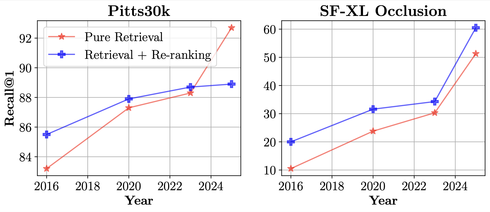

# To-Match-or-Not-to-Match
This repository contains the official PyTorch implementation for the paper "To Match or Not to Match: Revisiting Image Matching for Reliable Visual Place Recognition" presented at CVPR 2025 [IMW](https://image-matching-workshop.github.io/) 2025. The code has been released ahead of the [conference](https://cvpr.thecvf.com/Conferences/2025).

[[ArXiv](https://arxiv.org/abs/2504.06116)] [[HTML](https://arxiv.org/html/2504.06116)] [[BibTex](https://github.com/FarInHeight/To-Match-or-Not-to-Match?tab=readme-ov-file#citation)]

<p align="center"></p>

_Figure 1. **Re-ranking with SuperGlue with VPR methods from different years** (NetVLAD, SFRS, EigenPlaces, MegaLoc). In the past, re-ranking the top-K VPR results with powerful image matching methods was guaranteed to improve results. With modern VPR models, this is now true only for certain datasets or types of images. This paper explores this phenomenon, aiming to determine whether re-ranking can be adaptively and confidently triggered for individual queries during deployment._

## Installation

### Dependencies

To create the required Python environment, please refer to the repositories that form the foundation of this work:
-  [alexstoken/image-matching-models](https://github.com/alexstoken/image-matching-models)
- [gmberton/VPR-methods-evaluation](https://github.com/gmberton/VPR-methods-evaluation)
- [MubarizZaffar/SUE](https://github.com/MubarizZaffar/SUE)

### Clone the Repository

To download the code, run the following commands in your terminal:

```bash
git clone --recursive https://github.com/FarInHeight/To-Match-or-Not-to-Match.git
cd To-Match-or-Not-to-Match
```

## Running the VPR Method

The Visual Place Recognition (VPR) pipeline begins with _image retrieval_. The goal is to retrieve the top-N database images for each query image. You can use the following command to retrieve the top-100 database images:

```bash
python VPR-methods-evaluation/main.py \
--num_workers 8 \
--batch_size 32 \
--log_dir '<log-dir>' \
--method megaloc \
--image_size 322 322 \
--database_folder '<path-to-database-folder>' \
--queries_folder '<path-to-queries-folder>' \
--num_preds_to_save 100 \
--recall_values 1 5 10 20 100 \
--save_for_uncertainty
```

## Running Image Matching and Re-Ranking

### Image Matching

Once you’ve retrieved the database images, you can perform a refinement step by matching the query image with each of the retrieved database images. This is done using an _image matching_ method, which counts the number of inliers between the query and each database image. Use the following example command to run the image matching:

```bash
python match_queries_preds.py \
--preds-dir '<path-to-preds-folder>' \
--matcher 'sift-lg' \
--device 'cuda'
```

### Re-Ranking

After calculating the inliers, you can re-rank the top-K database images based on their inliers. Run the following example command to perform re-ranking:

```bash
python reranking.py '<path-to-preds-folder>' --inliers-dir '<path-to-inliers-folder>'
```

## Evaluating Uncertainty Estimation

To evaluate uncertainty estimation on the retrieved results, you can use the following example command:

```bash
python -m vpr_uncertainty.eval \
--preds-dir '<path-to-preds-folder>' \
--inliers-dir '<path-to-inliers-folder>' \
--z-data-path '<path-to-z-data-file>'
```
or
```bash
cd vpr_uncertainty
python eval.py \
--preds-dir '<preds-dir>' \
--inliers-dir '<path-to-inliers-folder>' \
--z-data-path '<path-to-z-data-file>'
```

## Citation

Please consider citing our work as:

```bibtex
@InProceedings{Sferrazza_2025_CVPR,
    author    = {Sferrazza, Davide and Berton, Gabriele and Trivigno, Gabriele and Masone, Carlo},
    title     = {To Match or Not to Match: Revisiting Image Matching for Reliable Visual Place Recognition},
    booktitle = {Proceedings of the Computer Vision and Pattern Recognition Conference (CVPR) Workshops},
    month     = {June},
    year      = {2025},
    pages     = {2849-2860}
}
```

### Acknowledgements

We would like to thank the authors of [alexstoken/image-matching-models](https://github.com/alexstoken/image-matching-models), [gmberton/VPR-methods-evaluation](https://github.com/gmberton/VPR-methods-evaluation) and [MubarizZaffar/SUE](https://github.com/MubarizZaffar/SUE) for making their code publicly available and without which this paper could not have taken place.

### License
[MIT License](LICENSE)
